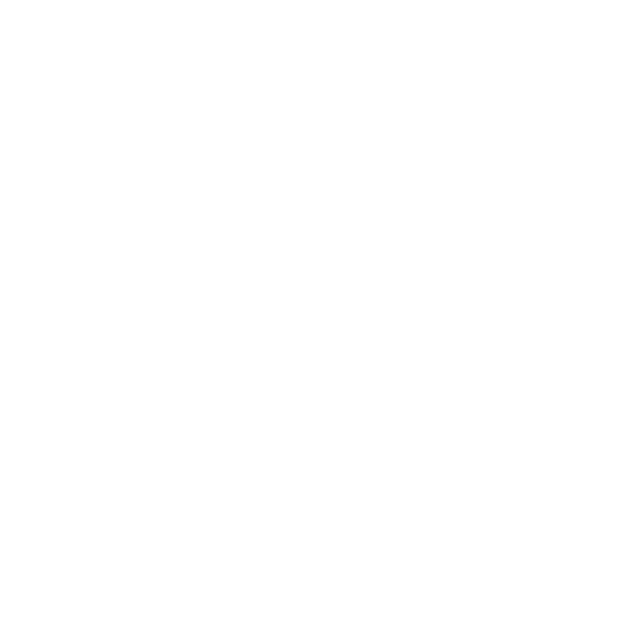

  

       Studying Systems Engineering  
       Currently studying backend development  
       Exploring projects with PHP and             JavaScript   
    
 
      
   
 
  

 

<h1 align="start">Languages and Tools</h1>

  
  
  
  
  
  
  
  

  
  

