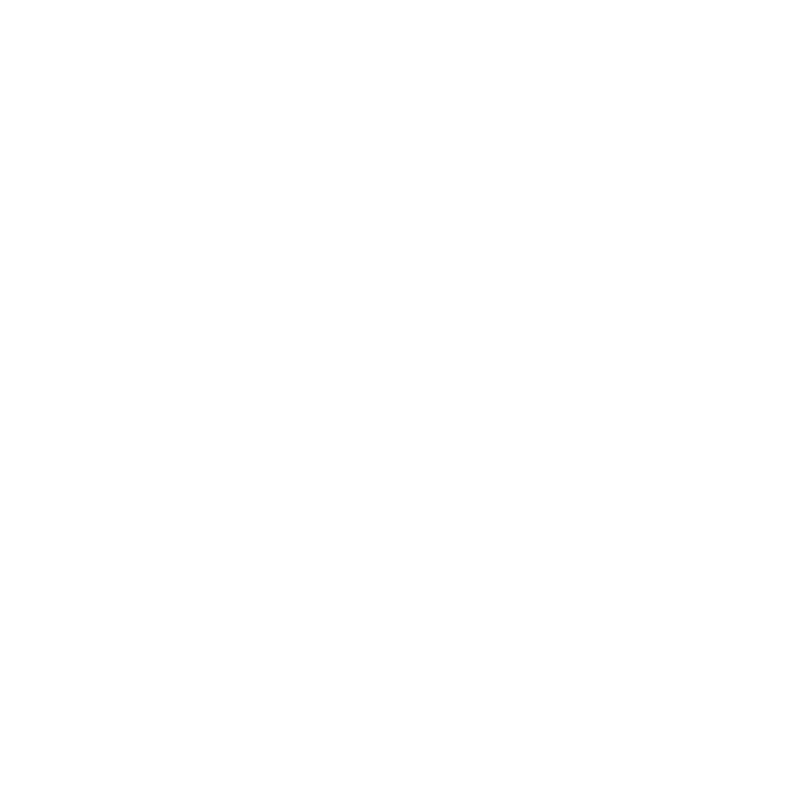

  

       Studying Systems Engineering  
       Currently studying backend development       
      <a  href="https://www.linkedin.com/in/ana-luiza-goncalves-leopoldino-marques/" style="text-decoration: none; display: block; text-align: center; margin-top: 10px;">
        

      </a>
  

